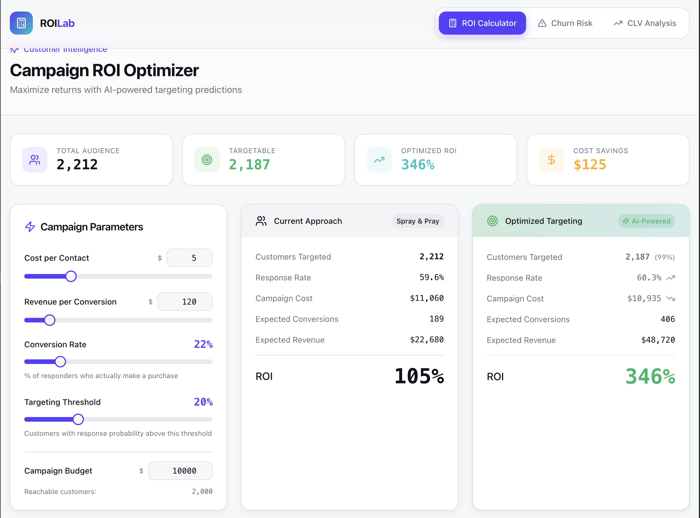
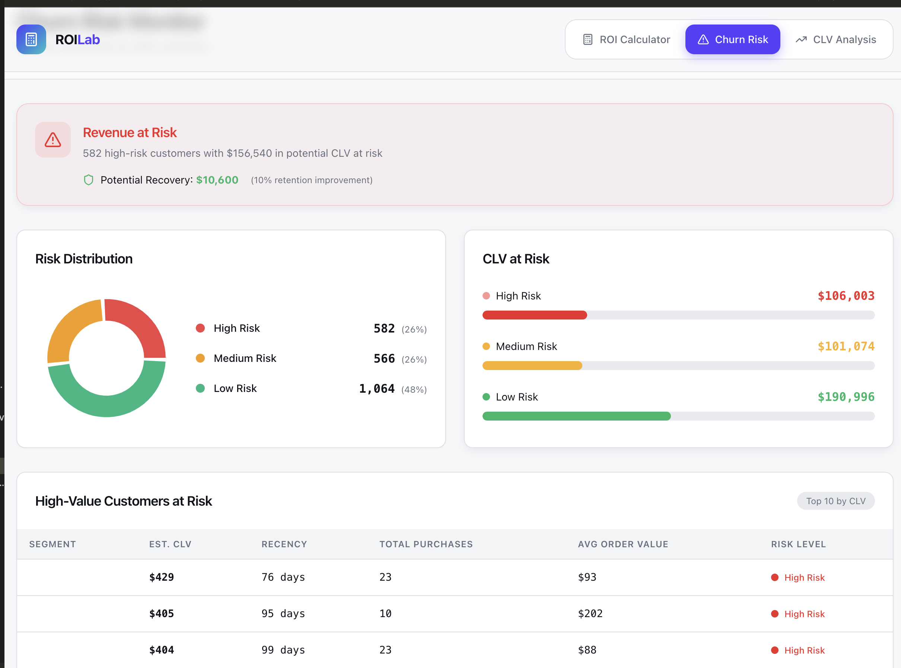

# DataForge-Labs Customer Intelligence Platform

A data-driven customer intelligence platform that leverages machine learning to optimize marketing ROI through predictive campaign targeting and churn prediction.

## Getting Started

### Data Analysis

The complete analysis is available in the Jupyter notebook:

```bash
jupyter notebook ClientInsights.ipynb
```

### Web Dashboard

Launch the interactive DataForge-Labs dashboard(a proof of concept):

```bash
cd app
npm install
npm run dev
```

## Data Source

Analysis based on the [Customer Personality Analysis dataset](https://www.kaggle.com/datasets/imakash3011/customer-personality-analysis) containing 2,240 customer records with demographics, purchase history, and campaign responses.

## User Interface

### Campaign Response Rate Analysis



### Churn Risk Monitoring


## Technical Stack

**Analysis**
- Python 3.x
- pandas, numpy
- scikit-learn (K-means, Random Forest, Gradient Boosting)
- matplotlib, seaborn

**Dashboard**
- React 18 + TypeScript
- Vite
- shadcn/ui + Radix UI
- TailwindCSS
- Recharts

## Authors

**Millan Das, Arthur de Leusse & Alexis Vannson**

## License

This project is licensed under the terms in the [LICENSE](LICENSE) file.
